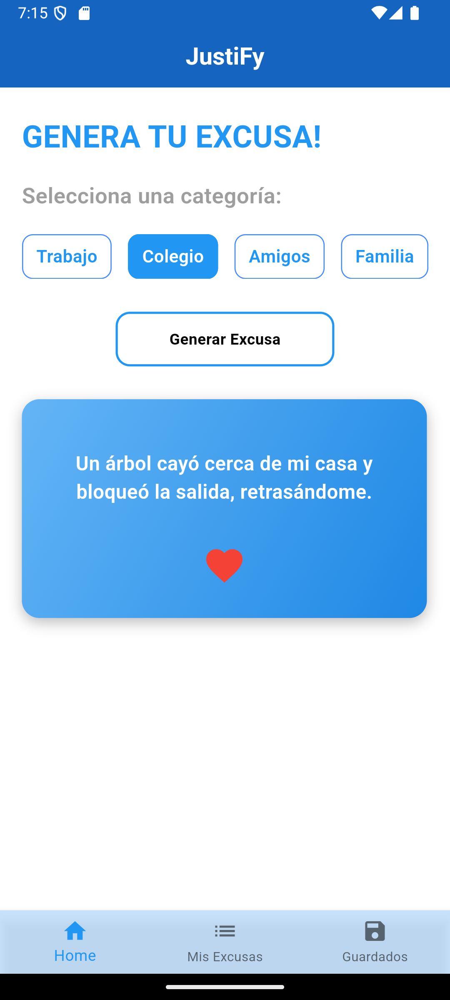
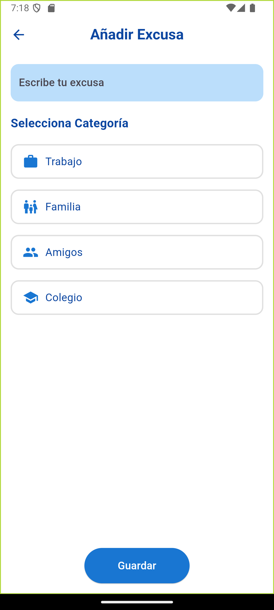
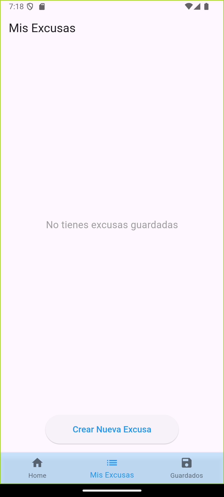
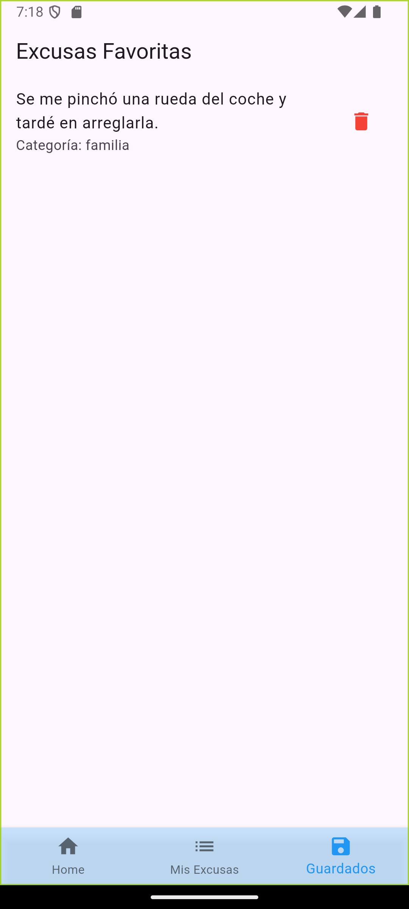

# JustiFy

JustiFy es una aplicación móvil que te ayuda a generar excusas para diferentes situaciones. Puedes seleccionar una categoría y generar una excusa al instante. También puedes guardar tus excusas favoritas para usarlas más tarde.

## Características

- Generación de excusas para diferentes categorías.
- Guardar excusas favoritas.
- Interfaz de usuario intuitiva y fácil de usar.

## Capturas de Pantalla

### Pantalla Principal

### Crear Nueva Excusa

### Excusas Guardadas

### Pantalla de Favoritos

## Uso

1. Abre la aplicación.
2. Selecciona una categoría.
3. Genera una excusa.
4. Guarda la excusa como favorita si lo deseas.